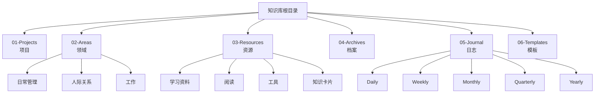
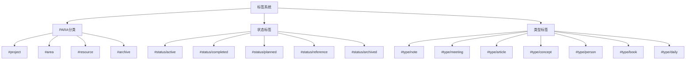
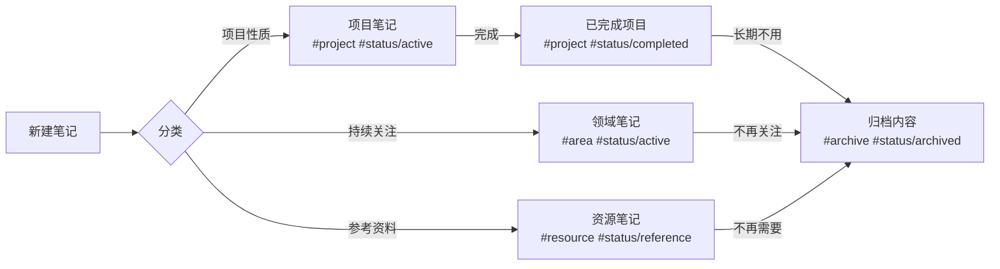

# PARA知识管理系统中心

## 什么是PARA系统？
PARA是一种知识管理方法，由Tiago Forte提出，代表：
- **Projects (项目)** - 有明确目标和截止日期的工作
- **Areas (领域)** - 需要持续关注和维护的责任领域
- **Resources (资源)** - 可能在未来有用的主题和资料
- **Archives (档案)** - 已完成或不再活跃的内容
**(新增)** 本库还增加了以下辅助文件夹：
- **Journal (日志)** - 定期记录与回顾
- **Templates (模板)** - 笔记结构模板

## 快速导航

### 1. 项目 (Projects)
![[01-Projects/Projects-MOC]]

### 2. 领域 (Areas)
![[02-Areas/Areas-MOC]]

### 3. 资源 (Resources)
![[03-Resources/Resources-MOC]]

### 4. 档案 (Archives)
![[04-Archives/Archives-MOC]]

### 5. 📓 05-Journal (日志)
*   **目的:** 定期记录、回顾和反思日常活动、思考和进展。通过不同时间维度的笔记（日、周、月、季、年）来追踪个人成长和模式。
*   **内容:**
    *   `Daily/`: 每日笔记，记录当天完成的任务、时间分配、思考和计划。模板: `[[06-Templates/template-daily]]`
    *   `Weekly/`: 每周回顾，汇总本周任务、活动、情绪，进行反思和计划。模板: `[[06-Templates/template-weekly]]`
    *   `Monthly/`: 每月回顾，总结月度成就、趋势，设定下月目标。模板: `[[06-Templates/template-monthly]]`
    *   `Quarterly/`: 季度回顾，进行更宏观的复盘和规划。模板: `[[06-Templates/template-quarterly]]`
    *   `Yearly/`: 年度回顾，总结全年，展望未来。模板: `[[06-Templates/template-yearly]]`
*   **自动化:** 依赖 `Periodic Notes` 和 `Templater` 插件自动创建和应用模板，`Commander` 插件实现启动时自动打开每日笔记。`Dataview` 用于在笔记中聚合信息。

### 6. 📄 06-Templates (模板)
*   **目的:** 存放所有笔记模板，确保新笔记结构的一致性，提高效率。
*   **内容:** 包含 PARA 各部分的标准模板、会议记录模板、以及 Journal 系统中使用的日、周、月、季、年回顾模板。
*   **使用:** 主要由 `Templater` 和 `Periodic Notes` 插件调用。

## 文件夹结构



- **01-Projects** - 存放所有项目相关笔记
- **02-Areas** - 存放责任领域相关笔记
  - 日常管理 - 个人生活管理
  - 人际关系 - 人际交往相关
  - 工作 - 工作职责相关
- **03-Resources** - 存放各类知识资源
  - 学习资料 - 课程和学习内容
  - 阅读 - 阅读笔记
  - 工具 - 工具使用说明
  - 知识卡片 - 零散知识点
- **04-Archives** - 存放已完成或不再活跃的内容
- **05-Journal** - 存放周期性笔记
  - Daily - 每日记录
  - Weekly - 每周回顾
  - Monthly - 每月回顾
  - Quarterly - 季度回顾
  - Yearly - 年度回顾
- **06-Templates** - 存放所有笔记模板

## 标签系统



PARA+STATUS标签组合系统包含三个维度：

### PARA分类标签
- `#project` - 项目相关内容
- `#area` - 责任领域
- `#resource` - 资源材料
- `#archive` - 归档内容

### STATUS状态标签
- `#status/active` - 进行中
- `#status/completed` - 已完成
- `#status/planned` - 计划中
- `#status/reference` - 参考资料
- `#status/archived` - 已归档

### 内容类型标签
- `#type/note` - 笔记
- `#type/meeting` - 会议
- `#type/article` - 文章
- `#type/concept` - 概念
- `#type/person` - 人物
- `#type/book` - 书籍
- `#type/daily` - 日记 (属于 Journal)
- `#type/weekly` - 周报 (属于 Journal)
- `#type/monthly` - 月报 (属于 Journal)
- `#type/quarterly` - 季报 (属于 Journal)
- `#type/yearly` - 年报 (属于 Journal)

## 常用标签组合

| 内容类型 | 标签组合 | 用途 |
|---------|---------|------|
| 活跃项目 | `#project #status/active` | 正在进行的项目 |
| 计划项目 | `#project #status/planned` | 未来要做的项目 |
| 已完成项目 | `#project #status/completed` | 已完成的项目 |
| 日常领域 | `#area #status/active` | 持续关注的领域 |
| 参考资料 | `#resource #status/reference` | 收集的资料 |
| 知识概念 | `#resource #type/concept` | 概念性知识 |
| 书籍笔记 | `#resource #type/book` | 书籍阅读笔记 |
| 日记 | `#journal #type/daily` | 每日记录 |
| 周报 | `#journal #type/weekly` | 每周回顾 |
| 月报 | `#journal #type/monthly` | 每月回顾 |
| 归档内容 | `#status/archived` | 已归档的内容 |

## 笔记流转



## 使用流程

### 创建新笔记
1. 确定笔记属于哪个PARA类别或Journal
2. 选择相应的模板：
   - 项目笔记：`[[06-Templates/模板名称]]` (请替换为实际模板路径)
   - 领域笔记：`[[06-Templates/模板名称]]`
   - 资源笔记：`[[06-Templates/模板名称]]`
   - 卡片笔记：`[[06-Templates/模板名称]]`
   - 日记：通过 Periodic Notes 自动使用 `[[06-Templates/template-daily]]`
   - 周报/月报等：通过 Periodic Notes 自动使用相应模板
3. 在相应文件夹中创建笔记 (Journal 笔记由插件自动创建)
4. 确保添加合适的PARA/Journal、STATUS和TYPE标签

### 项目管理
1. 创建项目时，使用项目模板并标记为 `#project #status/active`
2. 项目完成后，更改标签为 `#project #status/completed`
3. 长期不活跃的项目，可以添加 `#status/archived` 并移至Archives文件夹

### 内容查询
利用Dataview查询特定内容，例如：
- 查询所有活跃项目：`#project #status/active`
- 查询特定领域下的笔记：`#area AND "02-Areas/工作"`
- 查询某一类型的资源：`#resource #type/book`

## 系统维护

1. 每周回顾：检查项目进展，更新状态
2. 每月整理：归档已完成项目，整理资源分类
3. 每季度检查：评估知识结构，优化标签系统

## 注意事项

1. 标签应保持一致性，遵循PARA+STATUS+TYPE三维度组合
2. 定期整理归档不再活跃的内容
3. 使用内容地图(MOC)维护知识间的链接关系
4. 善用Dataview查询功能整合和查找信息

## 活跃项目一览

## 最近笔记

```dataview
TABLE 
  file.cday as "创建日期"
FROM -"模板"
SORT file.mday DESC
LIMIT 10
```

## CSS 代码片段说明

以下是 `.obsidian/snippets` 文件夹中使用的 CSS 代码片段及其功能说明：

1.  **【项目管理】sharetype.css**: 美化或调整与项目管理相关的笔记或视图样式。
2.  **【进度颜色】colourful progress bar.css**: 为进度条添加不同的颜色，使其更加醒目。
3.  **【音乐播放器】Music Player.css**: 添加或美化 Obsidian 中的音乐播放器界面样式。
4.  **【边栏图标】sidepane.css**: 自定义 Obsidian 侧边栏的图标样式或添加新图标。
5.  **【日记时间轴】Time.css**: 将日记或特定笔记以时间轴的视觉样式展示。
6.  **【生日倒计时】birthday countdown.css**: 设置显示生日倒计时的元素样式。
7.  **【收件箱图标】收件箱icon.css**: 在界面某处（如文件夹或特定笔记）添加"收件箱"图标。
8.  **【情绪记录】MoodTracker.css**: 美化情绪记录相关元素，可能配合 Dataview 或其他插件在日记中使用。
9.  **【卡片视图】zettelkasten.css**: 将笔记渲染成卡片样式，模仿 Zettelkasten（卡片盒笔记法）的视觉效果。
10. **【分栏支持】admonition-col2-col3-flex.css**: 提供 CSS 代码，使笔记内容（可能是 Admonition 块或其他元素）能够实现两栏或三栏的布局。
11. **【便签样式】stickies.css**: 将特定的笔记或 Callout 块渲染成类似便利贴（便签）的样式。
12. **【侧边栏设置】rightlane setting.css**: 针对 Obsidian 右侧边栏进行个性化的样式设置或调整。
13. **【侧边栏播放器图标】rightlane music player icon.css**: 在右侧边栏为音乐播放器功能添加或修改图标样式。
14. **【主页设置移动端】homepage setting media mobile.css**: 针对移动设备优化自定义主页布局的 CSS 样式。
15. **【主页设置】homepage setting.css**: 包含设置自定义主页布局的主要 CSS 样式。
16. **【AD优化】admonitions.css**: 对 Admonitions 插件生成的 Callout 块进行样式上的优化或调整。 