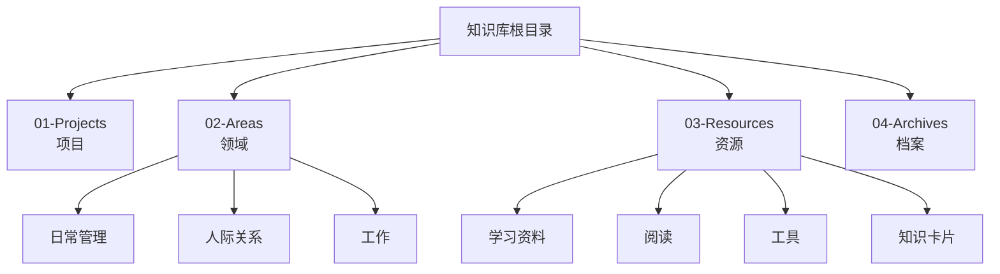
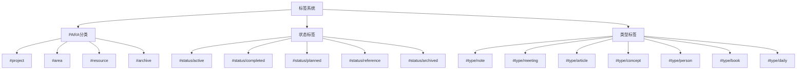
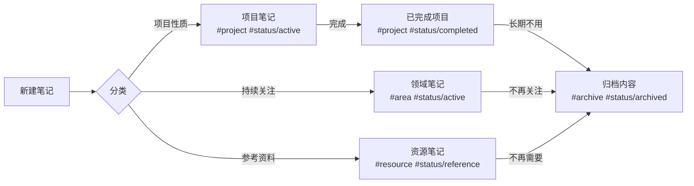

# PARA知识管理系统中心

## 什么是PARA系统？
PARA是一种知识管理方法，由Tiago Forte提出，代表：
- **Projects (项目)** - 有明确目标和截止日期的工作
- **Areas (领域)** - 需要持续关注和维护的责任领域
- **Resources (资源)** - 可能在未来有用的主题和资料
- **Archives (档案)** - 已完成或不再活跃的内容

## 快速导航

### 1. 项目 (Projects)
![[01-Projects/Projects-MOC]]

### 2. 领域 (Areas)
![[02-Areas/Areas-MOC]]

### 3. 资源 (Resources)
![[03-Resources/Resources-MOC]]

### 4. 档案 (Archives)
![[04-Archives/Archives-MOC]]

## 文件夹结构



- **01-Projects** - 存放所有项目相关笔记
- **02-Areas** - 存放责任领域相关笔记
  - 日常管理 - 个人生活管理
  - 人际关系 - 人际交往相关
  - 工作 - 工作职责相关
- **03-Resources** - 存放各类知识资源
  - 学习资料 - 课程和学习内容
  - 阅读 - 阅读笔记
  - 工具 - 工具使用说明
  - 知识卡片 - 零散知识点
- **04-Archives** - 存放已完成或不再活跃的内容

## 标签系统



PARA+STATUS标签组合系统包含三个维度：

### PARA分类标签
- `#project` - 项目相关内容
- `#area` - 责任领域
- `#resource` - 资源材料
- `#archive` - 归档内容

### STATUS状态标签
- `#status/active` - 进行中
- `#status/completed` - 已完成
- `#status/planned` - 计划中
- `#status/reference` - 参考资料
- `#status/archived` - 已归档

### 内容类型标签
- `#type/note` - 笔记
- `#type/meeting` - 会议
- `#type/article` - 文章
- `#type/concept` - 概念
- `#type/person` - 人物
- `#type/book` - 书籍
- `#type/daily` - 日记

## 常用标签组合

| 内容类型 | 标签组合 | 用途 |
|---------|---------|------|
| 活跃项目 | `#project #status/active` | 正在进行的项目 |
| 计划项目 | `#project #status/planned` | 未来要做的项目 |
| 已完成项目 | `#project #status/completed` | 已完成的项目 |
| 日常领域 | `#area #status/active` | 持续关注的领域 |
| 参考资料 | `#resource #status/reference` | 收集的资料 |
| 知识概念 | `#resource #type/concept` | 概念性知识 |
| 书籍笔记 | `#resource #type/book` | 书籍阅读笔记 |
| 日记 | `#area #type/daily` | 每日记录 |
| 归档内容 | `#status/archived` | 已归档的内容 |

## 笔记流转



## 使用流程

### 创建新笔记
1. 确定笔记属于哪个PARA类别
2. 选择相应的模板：
   - 项目笔记：`03-Resources/工具/模板/PARA/项目模板`
   - 领域笔记：`03-Resources/工具/模板/PARA/领域笔记模板`
   - 资源笔记：`03-Resources/工具/模板/PARA/资源笔记模板`
   - 卡片笔记：`03-Resources/工具/模板/PARA/卡片笔记模板`
   - 日记：`03-Resources/工具/模板/PARA/每日笔记模板`
3. 在相应文件夹中创建笔记
4. 确保添加合适的PARA、STATUS和TYPE标签

### 项目管理
1. 创建项目时，使用项目模板并标记为 `#project #status/active`
2. 项目完成后，更改标签为 `#project #status/completed`
3. 长期不活跃的项目，可以添加 `#status/archived` 并移至Archives文件夹

### 内容查询
利用Dataview查询特定内容，例如：
- 查询所有活跃项目：`#project #status/active`
- 查询特定领域下的笔记：`#area AND "02-Areas/工作"`
- 查询某一类型的资源：`#resource #type/book`

## 系统维护

1. 每周回顾：检查项目进展，更新状态
2. 每月整理：归档已完成项目，整理资源分类
3. 每季度检查：评估知识结构，优化标签系统

## 注意事项

1. 标签应保持一致性，遵循PARA+STATUS+TYPE三维度组合
2. 定期整理归档不再活跃的内容
3. 使用内容地图(MOC)维护知识间的链接关系
4. 善用Dataview查询功能整合和查找信息

## 活跃项目一览

```dataview
TABLE 
  file.cday as "创建日期",
  file.mday as "最后修改"
FROM #project #status/active
SORT file.mday DESC
```

## 最近笔记

```dataview
TABLE 
  file.cday as "创建日期"
FROM -"模板"
SORT file.mday DESC
LIMIT 10
``` 