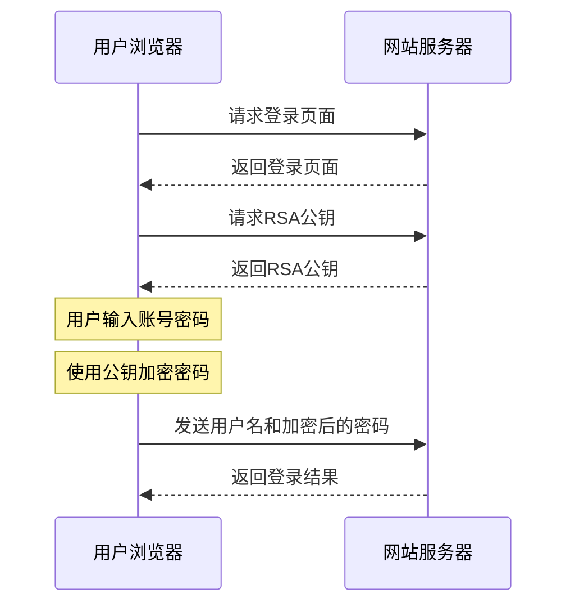

# RSA登录加密原理与实现方法

## 1. RSA加密登录基本原理

RSA是一种非对称加密算法，广泛应用于安全通信中。在网站登录场景中的基本工作流程如下：

1. 客户端向服务器请求获取RSA公钥
2. 服务器生成并返回RSA公钥
3. 客户端使用公钥加密密码
4. 客户端将加密后的密码发送给服务器
5. 服务器使用私钥解密得到原始密码
6. 服务器验证密码是否正确

这种方式可以有效防止密码在传输过程中被窃取，因为即使攻击者截获了加密的密码，没有私钥也无法解密。

## 2. 网站登录中的RSA应用场景

### 2.1 典型流程分析

在实际的网站登录中，RSA加密通常遵循以下详细流程：



### 2.2 安全增强措施

一些网站会在基本RSA加密的基础上增加额外的安全措施：

- **时间戳混合**：在密码中加入时间戳，防止重放攻击
- **会话标识**：在加密数据中加入会话ID
- **多重加密**：结合其他加密算法，如先进行MD5哈希再RSA加密
- **动态公钥**：每次登录请求使用不同的公钥

## 3. RSA加密在Python爬虫中的实现

### 3.1 获取公钥

```python
def get_public_key(self):
    """获取网站的RSA公钥"""
    response = self.session.get(self.public_key_url)
    if response.status_code == 200:
        data = response.json()
        return data.get("public_key")
    return None
```

### 3.2 JavaScript方式加密（通过execjs调用）

```python
def encrypt_with_js(self, password, public_key):
    """使用JavaScript加密密码"""
    with open("encrypt.js", "r", encoding="utf-8") as f:
        js_code = f.read()
    
    ctx = execjs.compile(js_code)
    encrypted = ctx.call("rsaEncrypt", password, public_key)
    return encrypted
```

### 3.3 Python原生方式加密

```python
def encrypt_with_python(self, password, public_key):
    """使用Python的RSA库加密密码"""
    from Crypto.PublicKey import RSA
    from Crypto.Cipher import PKCS1_v1_5
    import base64
    
    key = RSA.importKey(public_key)
    cipher = PKCS1_v1_5.new(key)
    encrypted = cipher.encrypt(password.encode())
    return base64.b64encode(encrypted).decode()
```

## 4. 常见问题与解决方案

### 4.1 公钥格式问题

有些网站返回的公钥不是标准PEM格式，需要进行处理：

```python
def format_public_key(self, key):
    """格式化公钥为PEM格式"""
    if "BEGIN PUBLIC KEY" not in key:
        key = f"-----BEGIN PUBLIC KEY-----\n{key}\n-----END PUBLIC KEY-----"
    return key
```

### 4.2 加密结果不一致问题

JavaScript和Python实现的RSA加密可能会有细微差异，主要原因有：

- 填充方式不同（PKCS#1 v1.5, OAEP等）
- 编码方式不同（Base64变种）
- 随机数生成器不同

解决方案是尽量使用与目标网站相同的加密环境，例如通过execjs调用网站原本的JavaScript加密代码。

### 4.3 长文本加密限制

RSA加密的明文长度受限于密钥长度，通常为：
- 2048位密钥：最大245字节
- 1024位密钥：最大117字节

对于超长内容，可以：
1. 分段加密
2. 使用对称加密（如AES）加密内容，再用RSA加密对称密钥

## 5. 实际案例分析

### 5.1 某招聘网站登录分析

该网站登录流程：
1. 请求获取公钥和token
2. 公钥格式为Base64编码，需转换为PEM格式
3. 密码加密时添加了时间戳混淆
4. 请求中需携带CSRF token

### 5.2 某在线教育平台登录分析

该平台登录特点：
1. 使用固定公钥（嵌入在前端JS中）
2. 密码先进行MD5哈希，再RSA加密
3. 登录请求中需要携带设备指纹信息

## 6. 防范措施

现代网站通常会采取多种措施防止爬虫模拟登录：

- 验证码机制
- 设备指纹识别
- 行为分析（输入速度、鼠标轨迹等）
- IP风险控制
- 登录频率限制

爬虫在模拟登录时需要考虑这些因素，并在合法、合规的前提下进行操作。

## 7. 参考资料

- [RSA加密算法原理](https://en.wikipedia.org/wiki/RSA_(cryptosystem))
- [Python PyCryptodome库文档](https://pycryptodome.readthedocs.io/)
- [Node.js中的RSA加密](https://www.npmjs.com/package/node-rsa)
- [Web安全-HTTPS原理](https://developer.mozilla.org/en-US/docs/Web/Security/Transport_Layer_Security) 