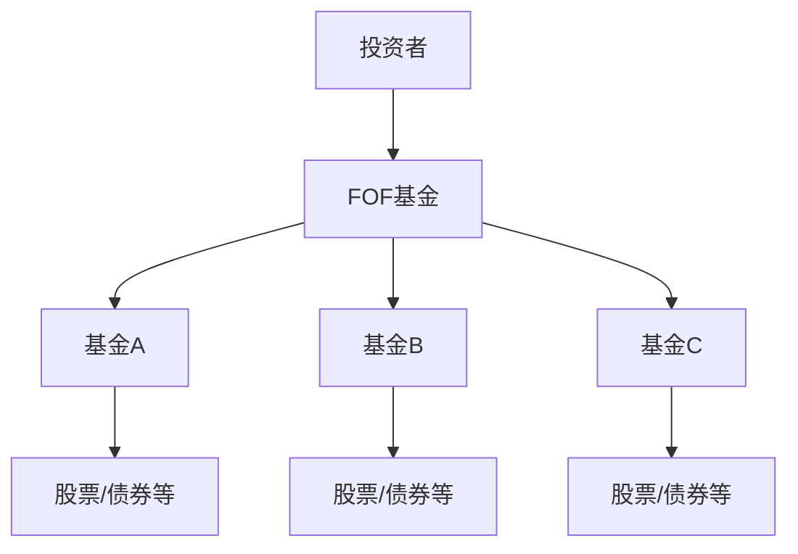

# FOF (Fund of Funds - 基金中的基金)

## 定义
以证券投资基金为投资对象的基金。

## 核心特征
- **投资标的**：其他证券投资基金
- **双重分散**：在基金层面和底层资产层面都实现分散投资
- **专业筛选**：由专业团队筛选优质基金

## 运作模式

## 投资优势
- **进一步分散风险**：通过投资多只基金降低单一基金风险
- **专业管理**：基金经理具备基金筛选专业能力
- **降低门槛**：小额资金也能投资多只优质基金
- **省时省力**：无需自己研究和选择基金

## 投资劣势
- **双重费用**：需承担FOF管理费和底层基金管理费
- **收益稀释**：多层管理可能稀释投资收益

## 适合投资者
- 缺乏基金选择经验的投资者
- 希望进一步分散风险的投资者
- 资金量较小的投资者

## 相关概念
- [[创新型基金]]
- [[证券投资基金]]
- [[分散投资]]
- [[基金管理]]

---
*来源：[[2/3章]]模块一 - 创新型基金*
