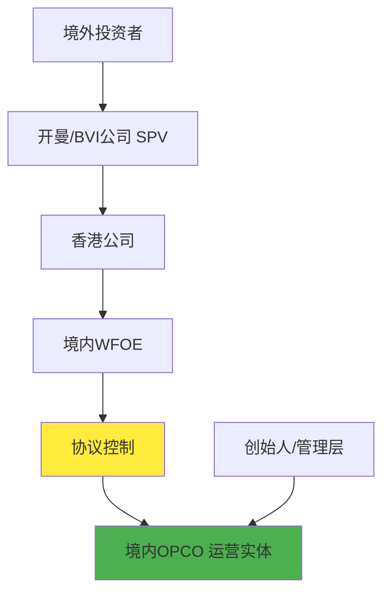

# VIE结构 (Variable Interest Entity - 协议控制)

## 定义
针对中国在互联网、电信、新闻传播、教育等行业对外资进入的限制，境内企业采用的一种境外上市模式。

## 核心机制
境外离岸公司不直接收购境内经营实体（OPCO），而是在境内设立外商独资企业（WFOE），通过与内资公司及其股东签订一系列协议，实现对内资公司的实际控制和利润转移。

## 结构组成

### 关键主体
- **[[特殊目的公司（SPV）]]**：在境外注册的上市主体
- **[[外商独资企业（WFOE）]]**：在境内设立的外资企业
- **[[境内运营实体（OPCO）]]**：实际经营业务的内资公司

### 常见注册地
- **英属维尔京群岛（BVI）**：税收优惠，法律环境成熟
- **开曼群岛（CAYMAN）**：公司法灵活，适合上市

## VIE架构图

## 协议控制内容
- **独家技术服务协议**：WFOE向OPCO提供技术服务
- **独家购买权协议**：WFOE有权购买OPCO股权或资产
- **投票权委托协议**：OPCO股东将投票权委托给WFOE
- **股权质押协议**：OPCO股权质押给WFOE

## 适用行业
主要用于外资限制或禁止进入的行业：
- 互联网信息服务
- 电信增值服务
- 新闻传播
- 教育培训
- 文化娱乐

## 典型案例
- 阿里巴巴
- 腾讯
- 百度
- 新东方
- 好未来

## 优势
- **规避外资限制**：绕过行业准入限制
- **境外融资**：获得国际资本市场融资
- **税收优化**：通过架构设计优化税负

## 风险
- **政策风险**：监管政策变化的不确定性
- **协议风险**：协议控制的法律效力存疑
- **汇率风险**：跨境资金流动的汇率波动

## 监管态度
中国政府对VIE结构的态度在不断演变，近年来加强了对相关行业的监管。

## 相关概念
- [[红筹股]]
- [[境外上市]]
- [[外资限制]]
- [[协议控制]]
- [[特殊目的公司]]

---
*来源：[[2/3章]]模块一 - 股票分类*
