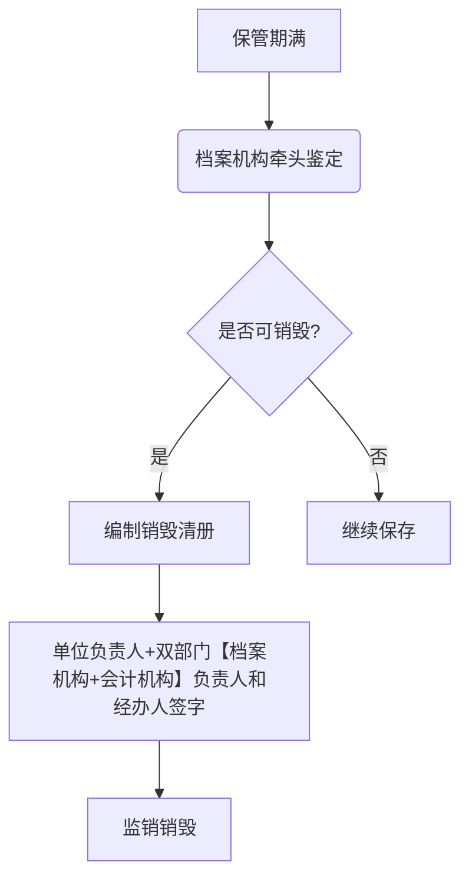
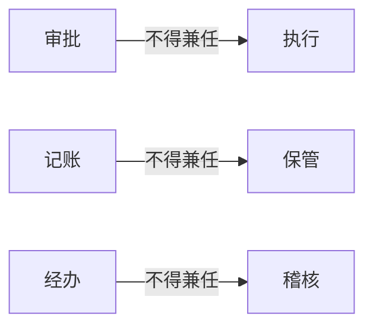

# 会计档案与会计监督核心考点分层整理
## 一、会计档案管理
### （一）会计档案定义与范围
1. **核心构成**：
   - 会计**凭证**（记账凭证、原始凭证）
   - 会计**账簿**（总账、明细账、固定资产卡片）
   - 财务会计**报告**（年报、季报、月报）
   - **其他档案**：
     ✅ 银行存款余额调节表
     ✅ 银行对账单
     ✅ 纳税申报表
     ✅ 三册一表（移交清册、保管清册、销毁清册、鉴定意见书）
   ❌ 非档案内容：财务预算、计划、合同、制度、合同文件
2. **典型例题**：
   **【多选题】** 下列属于会计档案的是（ ）  
   A. 固定资产卡片  
   B. 年度财务报告  
   C. 银行对账单  
   D. 采购合同  
   **答案**：ABC ✅
---
### （二）档案管理程序
#### 归档要求
| 关键流程 | 操作要求                                  | 注意事项           |
| ---- | ------------------------------------- | -------------- |
| 归档主体 | 会计机构负责归档                              | 需编制《保管清册》      |
| 电子档案 | 满足条件可仅存电子形式                           | 需符合《电子签名法》要求   |
| 移交期限 | 正常移交：会计年度终了后**1年** 特殊情况延期：最长**3年** | 涉及企业所得税汇算清缴等业务 |
#### 销毁程序

**监销要求**：
- 普通档案：会计机构+档案机构双监销
- 电子档案：会计机构+档案机构双监销+增加**信息系统管理机构**监销
- 禁止销毁情形【还要用的】：未结清债权债务凭证/涉及未了事项档案
---
### （三）保管期限{重要加排除}
| 档案类型          | 保管期限 | 特殊情形                   |
| ------------- | ---- | ---------------------- |
| 年报/销毁清册/鉴定意见书 | 永久   | -                      |
| 凭证/账簿/移交清册    | 30年  | 固定资产卡片是账簿：报废后**再保管5年** |
| 其他财报/银行单据/纳税表 | 10年  | 计算起点：会计年度终了后**第1天**    |
**典型例题**：
**【单选题】** 固定资产卡片应保管至（ ）  
A. 固定资产报废时  
B. 固定资产报废后5年  
C. 固定资产使用期满后10年  
**答案**：B ✅
![[Pasted image 20250212231033.png]]
---
## 二、会计监督体系
### （一）监督类型对比
| 类型   | 监督主体      | 监督对象     | 典型案例      |
| ---- | --------- | -------- | --------- |
| 内部监督 | 会计机构/人员   | 单位经济活动   | 出纳不得兼管档案  |
| 政府监督 | 财政部门+其他部门 | 社会单位会计工作 | 税务局检查纳税申报 |
| 社会监督 | 注册会计师/公众  | 委托单位财务报告 | 上市公司年报审计  |
---
### （二）内部控制要点
#### 不相容职务分离

**典型例题**：
**【判断题】** 总账会计可兼任固定资产保管员（ ）  
**答案**：✗（违反不相容职务分离原则）
---
### （三）审计报告类型
| 报告类型 | 特征 | 示例情形 |
|----------|------|----------|
| 标准审计报告 | 无保留意见+无修饰语 | 财务报表完全合规 |
| 非标审计报告 | 保留意见/否定意见/无法表示意见 | 存在重大错报未调整 |
---
## 三、高频错题集
### （一）选择题
1. **【多选题】** 电子档案移交需检测（ ）  
   A. 安全性  
   B. 准确性  
   C. 完整性  
   D. 可用性  
   **答案**：ABCD ✅
2. **【判断题】** 会计档案销毁后需单位负责人在清册签字（ ）  
   **答案**：✗（监销人签字即可）
---
### （二）实务辨析
**案例**：甲公司将2023年会计档案移交档案部门的时间应为______  
A. 2023年12月31日  
B. 2024年1月1日  
C. 2024年12月31日  
D. 2026年12月31日（经批准延期）  
**解析**：正常移交为会计年度终了后1年，即2024.12.31；特殊延期最长至2026.12.31  
**答案**：CD ✅
### 第一部分：不相容职务与判断题
#### 不相容职务
- **业务经办与记录** ：不相容，必须各为一人。
- **记录与保管** ：不相容，必须各为一人。
- **经办与稽核** ：不相容，必须各为一人。
- **选择题答案** ：abcd 全选。
#### 判断题
- **题目** ：某企业为了加强内部管理，提高工作效率，决定由总账会计小张兼任财务保管。这种安排并不违反企业内部控制的要求。
- **分析** ：总账会计小张是记账人员，又记账又保管，可能会贪污财物并隐瞒，违反不相容职务规定。
- **答案** ：错误。
### 第二部分：政府监督
#### 主体
- **财政部门** ：国家财政部管理全国会计工作，制定统一的会计政策；县级以上人民政府财政部门管理本区域内会计工作，包括监督社会上各个单位的会计工作。
- **财政部门以外的其他部门** ：重要主体是财政部门，包括国务院财政部以及省级以上人民政府财政部的派出机构和县级以上人民政府的财政部门。省级人民政府的派出机构如大兴安岭行政公署。
#### 监督内容
- 是否依法设置会计账簿。
- 会计资料是否真实完整。
- 会计核算是否符合会计法和国家统一的会计制度。
- 从事会计工作的人员是否具备专业能力，是否遵循职业道德。
#### 其他政府主体
- **审计、税务、金融监管、证券监管等部门** ：依照有关法律、行政法规的规定，在职责和权限内可对有关单位的会计资料实施监督。
- **保密义务** ：政府部门在监督过程中，有义务对知悉的国家秘密、商业秘密保密。
#### 选择题
- **多选题** ：对单位会计资料有监督检查权的机构有哪些？
    - **答案** ：金融监管、税务总局、财政局、审计局，全选 abcd。
- **单选题** ：根据会计法律制度规定，下列行为中属于会计工作政府监督的是？
    - **选项** ：个人检举会计行为（社会监督）、会计师事务所（社会监督）、单位内部审计机构审核本单位的会计账簿（内部监督）、财政部门对各单位的会计工作进行监督检查。
    - **答案** ：d。
### 第三部分：社会监督
#### 两个维度
- **注册会计师及其所在的会计师事务所** ：对委托单位的经济活动进行监督，需受到委托才有权利开展工作，如上市公司财报需委托会计师事务所及其注册会计师进行审计，对委托单位的资料进行监督并出审计报告。
- **任何单位和个人** ：可以对违法违规的会计行为检举揭发。
#### 审计报告
- **定义** ：注册会计师及其所在的事务所接受委托，在执行审计工作的基础上，根据审计准则对被审计单位的财务报表发表审计意见。
- **具体内容** ：审被审计单位的会计报表是否在所有重大方面按照适用的财务报告编制基础编制，并实现公允反应。
- **类型** ：分标准和非标。标准审计报告是毫无瑕疵、无保留意见、不含说明段等修饰性用语的；非标包括否定意见、保留意见、无法表示意见、带强调事项等。
### 审计报告类型
#### 分类
- **标准审计报告** ：**毫无瑕疵**，不含说明段、强调事项段、其他事项段或其他任何修饰性用语，并且是无保留意见的审计报告。
- **非标准审计报告（非标）** ：带一点点保留的都属于非标，包括否定意见、保留意见、无法表示意见以及带强调事项段等情况的审计报告。
#### 选择题
- **题目** ：请看题属于非标的。
- **选项** ：
    - a. 否定意见
    - b. 保留意见
    - c. 无法表示意见
    - d. 带强调事项
- **答案** ：abcd 全选。
- **解释** ：否定意见、保留意见、无法表示意见以及带强调事项的审计报告都属于非标。
### 会计监督相关题目
#### 单选题
- **题目** ：甲公司实施的下列会计监督中，属于社会监督的是？
- **选项** ：
    - a. 财政局对甲公司
    - b. 会计师事务所对甲公司进行年报审计
    - c. 甲公司的审计部门对本公司会计账簿进行监督
    - d. 税务局对甲公司开展
- **答案** ：b。
- **解释** ：财政局和税务局对甲公司的监督属于行政监督，甲公司审计部门对本公司会计账簿进行监督属于内部审计，只有会计师事务所对甲公司进行年报审计属于社会监督。
#### 判断题
- **题目** ：任何单位和个人都有权检举违法会计行为。
- **答案** ：正确。
- **解释** ：这属于会计工作的社会监督。
### 三类监督小结
#### 单位内部监督
会计机构和会计人员对本单位经济活动实施监督。
#### 外部监督
- **政府监督（行政监督）** ：县级以上财政部门对各单位的会计工作可以实施监督，审计、税务、金融、证券等部门对有关单位的会计资料进行监督。
- **社会监督** ：注册会计师事务所及其注册会计师对委托单位的经济活动、财务报表进行监督，任何单位和个人可以检举违法行为。
![[Pasted image 20250212235127.png]]