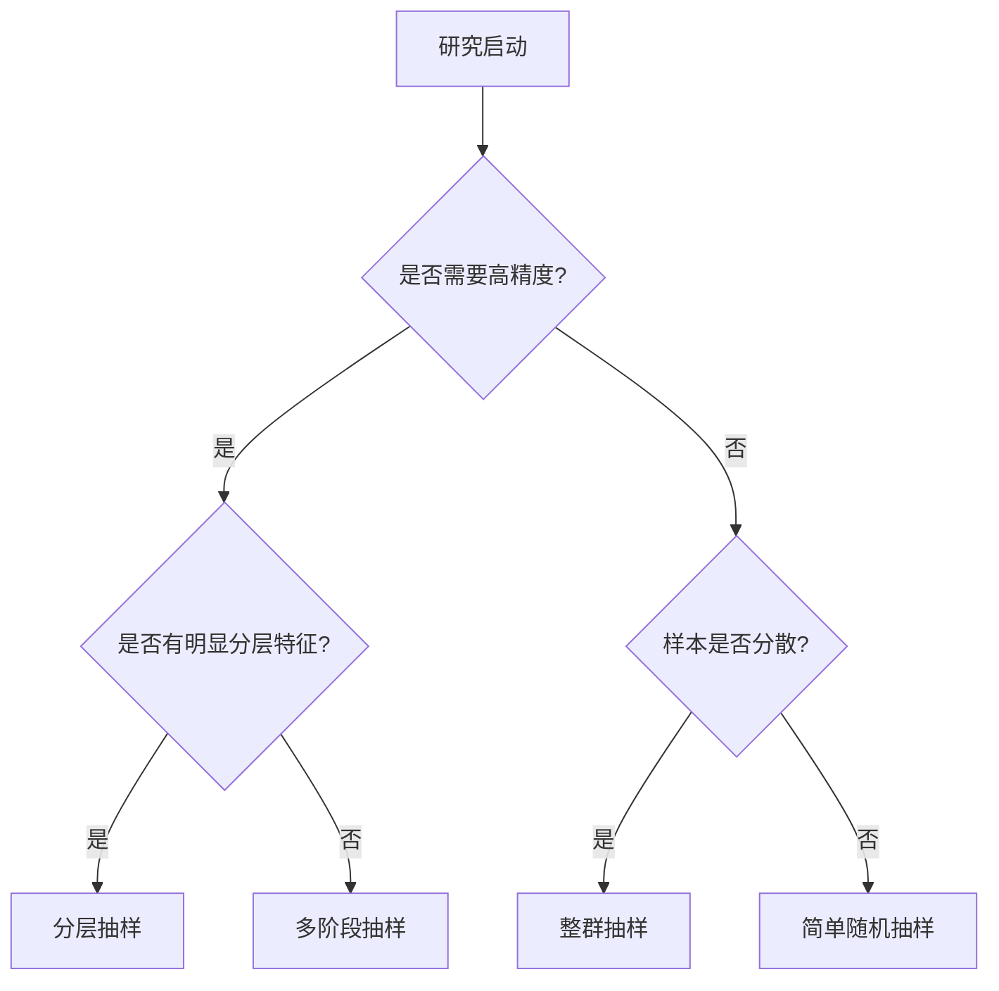

# 020101 📊

## 一、数据来源分类（基于使用者角度）
- **间接来源**（二手数据）📚：他人收集整理好的数据（如统计局网站数据）
- **直接来源**（一手数据）🖋️：研究者自行收集的数据（调查/实验）

---

## 二、间接来源数据详解
### （一）核心特点
✅ **优点**：
1. **省时省力**：难度小、速度快、成本低
2. **应用广泛**：如GDP数据可支持多领域研究
3. **资料完整**：包含统计方法/口径等背景信息

⚠️ **局限性**：
1. 相关性不足（例：常住人口≠总人口）
	- 不是为了特定的目的；数据
2. 统计口径差异（例：牛粪是否计入GDP）
3. 准确性存疑（需侧面验证）
4. 时效性滞后（网购数据需最新）

### （二）数据搜集范围
| 类型       | 数据来源示例       |     |
| -------- | ------------ | --- |
| **内部数据** | 企业业务/财务记录    |     |
| **宏观数据** | 统计局/政府部门公开数据 |     |
| **行业数据** | 行业协会/咨询公司报告  |     |
| **文献数据** | 学术论文/会议资料    |     |

### （三）数据评估四要素 🔍
1. **Who**：收集者的资质与信誉
2. **Why**：原始收集目的（警惕利益导向）
3. **How**：抽样方法与数据质量
4. **When**：数据时效性

---

## 三、直接来源数据解析
### （一）调查 vs 实验对比
| 调查数据            | 实验数据            |
| --------------- | --------------- |
| 通过**调查方法**获得的数据 | 通过**实验方法**得到的数据 |
| 通常是对**社会现**象而言  | 通常是对**自然**现象而言  |
| 通常取自有限总体        | 看作无限总体          |
### （二）调查方法分类
1. **全面调查**（普查）🌐：
   - 优点：数据完整准确
   - 限制：成本高、调查不可行（例：产品寿命测试）

2. **抽样调查**🎯：
   - 适用场景：无限总体/资源有限/破坏性调查
   - 核心优势：性价比高（允许合理误差）


---

# 020102


# 贾俊平《统计学》第二章精讲·下篇 📊
## 一、优质样本的三大黄金标准 🎯

### （一）双重相对性原则
1. **目的匹配度** 🔗
   - 样本需精准对应研究问题（如消费习惯研究需覆盖各年龄段）
   - 案例：研究网购行为需包含不同电商平台用户

2. **成本精度平衡术** ⚖️
   | 策略          | 执行方式                  |
   |---------------|---------------------|
   | **精度优先**  | 增加样本量→成本↑误差↓    |
   | **成本优先**  | 优化抽样设计→成本↓误差可控 |


---

## 二、概率抽样全解析 🎲
### （一）核心四要素
是指遵循随机原则进行的抽样，总体中每个单位都有一定的机会被选入样本。
1.**都有一定的机会**（概率）
p>0,(i=1,2,,N
p=p,(i卡)
等概率抽样
否则
不等概率抽样
2.每个单位被抽中的概率是已知的，或是可以计算出来的
3.按一定的概率以随机原则抽取样本
4,当用样本对总体目标量进行估计时，要考虑到每个样本单位被抽中的概率

1. **随机原则** 🎰：排除主观干扰（如抽签代替**随意**拦截）
	- 破坏了
2. **概率透明** 🔍：每个体入样概率已知（例：700人中抽10人，每人概率1/70）
3. **可计算性** 🧮：样本均值理论分布预判（详见案例）
4. **推断依据** 📐：入样概率决定统计推断可靠性

**案例演示**：3人总体抽2人

| 样本组合  | 均值  | 出现概率 |     |
| ----- | --- | ---- | --- |
| (1,1) | 1   | 1/9  |     |
| (1,2) | 1.5 | 2/9  |     |
| (2,3) | 2.5 | 2/9  |     |


---

## 三、五大抽样方法矩阵 🌟
### （一）简单随机抽样 🎯
**操作步骤**：
1. 构建抽样框（如学号列表）
2. 随机数表法抽选（示例：700人抽10人）
   - 编号001-700 → 随机起点 → 三位数筛选

**特点对比**：

| 优势       | 局限           |
| -------- | ------------ |
| 操作简单直观📖 | 样本分散难实施🚶♂️  |
| 理论计算便捷🧮 | 大规模抽样框构建难🏗️ |


---

### （二）分层抽样 🍰
**执行策略**：
1. **比例分配**：男70%女30% → 按比例抽选
2. **优化分配**：波动大的层增加样本量（如女性收入差异大→抽60%）

**典型应用**：
- 行业研究（按企业规模分层）
- 教育调查（按学校类型分层）

**精度提升原理**：
```
总方差 = 层间方差 + 层内方差
分层抽样有效降低层内方差 → 提高估计精度📈
```

---

### （三）整群抽样 🏢
**操作示例**：
1. 将小区20栋楼划分为群
2. 随机抽2栋 → 全面调查选中楼栋居民

**精度控制技巧**：
- 群内异质性高时效果佳（如每栋楼居民结构多样）
- 避免"群间差异大+群内同质化"组合⚠️

**形象比喻**：
> "整群抽样如同开盲盒——选中优质群则事半功倍🎁，选中偏差群则误差倍增💣"

---

### （四）系统抽样 🔢
**四步操作法**：
1. 排序（无关变量/相关变量/自然顺序）
2. 计算间隔k=N/n（如100人抽5人→k=20）
3. 随机起点r（1≤r≤k）
4. 按规则抽取（r, r+k, r+2k...）

**特殊场景处理**：
- 周期性数据：调整间隔避免规律性偏差（如避开整点客流高峰⏰）

---

### （五）多阶段抽样 🪜
**三阶段案例**：
```
省级抽样 → 市级抽样 → 街道抽样 → 户级调查
```

**核心优势**：
1. 成本控制：仅需局部抽样框
2. 灵活性：不同阶段采用不同方法（如省级整群→市级分层）

**精度警示**：
> 每增加一个阶段 → 随机误差累积风险↑（建议不超过3阶段）

---

## 四、抽样方法决策树 🌳


## 五、现代抽样技术前沿 🚀
- **大数据融合抽样**：结合网络爬虫与传统抽样
- **自适应抽样**：动态调整抽样策略（如疫情流调）
- **空间抽样**：GIS技术支持的地理分布优化

> 📌 **特别提示**：当研究涉及敏感数据时，优先选择整群抽样保护隐私🔒！