## 财务管理学 总论=
## 知识要点

1. 财务管理的概念

2. 财务管理的目标

3. 财务管理环境

4. 财务管理的目标

__________

__________

3

## 第一节 财务管理的概念

- 概念:是组织企业 财务活动,处理财务关系的一项管理工作。

- 可以说是人类历史上最伟大的发明之一,她深刻地影响了人们的思维模式、生活方式和行为准则。

- 很难定义

__________

什么是企业？ __________

## 企业的组织形式

__________

__________

## 一、个人独资企业

只有一个所有者的企业,这个所有者对企业的全部债务承担无限责任。是最古老的商业组织形式。 非法人。

\( \bullet \) 优点:(1)企业开办、转让、关闭的手续简便；(2)企业主对债务承担无限责任,会尽心经营企业；(3)税负较轻；(4)制约因素较少,决策效率高；(5)技术和财务信息容易保密。

缺点:(1)独资企业要承担无限责任,风险大；(2)筹资困难；(3)企业寿命有限:个体业主制的企业存续期受制于业主本人的生命期。

__________

## 二、合伙企业

__________

合伙制是指由两个或两个以上的人在一起创办企业。也为非法人。

## 种类:

- 普通合伙企业；合伙人都负无限责任

- 有限合伙企业。只有一个合伙人负有无限责任,其他人负有限责任。如会计师事务所,律师事务所

- 优点:开办容易,费用较低

- 缺点:责任无限、权力分散、产权转让困难

## 三、公司

·依照国家相关法律集资创建的,实行自主经营、自负盈亏,由法定出资人(股东)组成的,具有法人资格的独立经济组织。股东的自然人属性与公司法人分离,意味着公司独立地对其债务承担责任,股东仅以其出资额为限对公司的债务承担责任。

。公司由三类不同的利益者组成:股东、董事会成员、公司高层管理者。股东选举董事会成员；董事会成员选举高层管理人员；高层管理人员以股东的利益为重,管理企业的日常经营活动。

·特点:

- 类型:

·股份有限公司:独立于所有者而依法存在。所有者的责任仅以其投资额为限。具有无限的生命。双重纳税。等额股份,发行股票。股东人数无上限的限制。

·有限责任公司: 不等额股份,不发行股票,只有出资证明。股东人数 2-50人。

。主要优点:1)有限责任；2)产权易于转让；3)无限存续期；4)易于筹资金。主要缺点: 对股东双重征税(公司所得税和个人所得税)；道德风险股东出资￥80 超出￥20 不用还

有限责任

典型的企业组织结构图造价值。

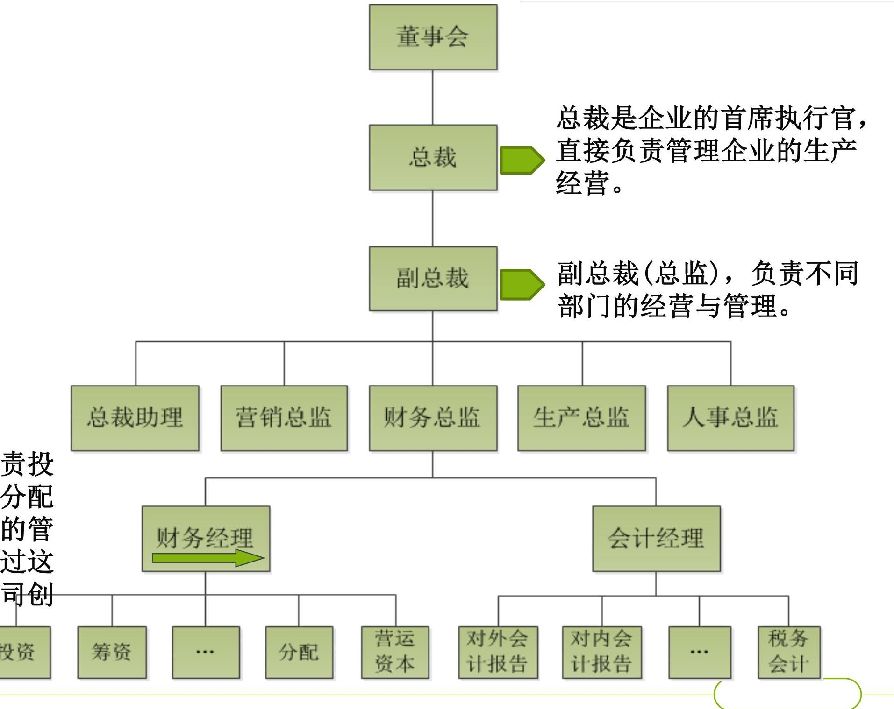

## 财务经理

__________

__________

(A)财务经理向金融市场发行证券得到现金 (B)将现金投资于企业运营 (C) 运营产生现金 (D) 支付税金 (E) 产生的现金留存企业 (F) 支付股利和债务财务经理的工作: 一部分是在企业与金融市场之间进行资金运作: 发行证券 \( \rightarrow \) 分配股利和偿还债务与一部分是配合公司经营机而动, 安排资金收支股份公司可以通过资本市场发行股票或发行债券募集资金有利于企业的资本扩张和规模扩大

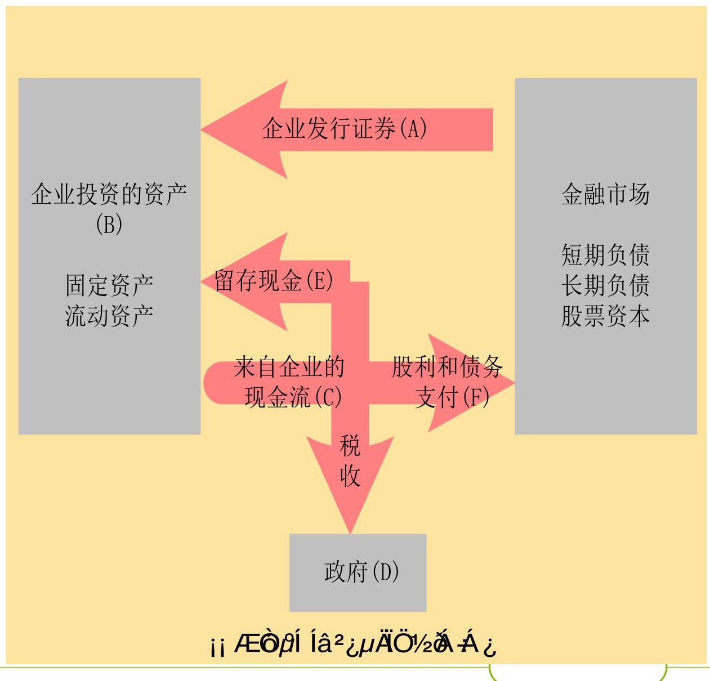

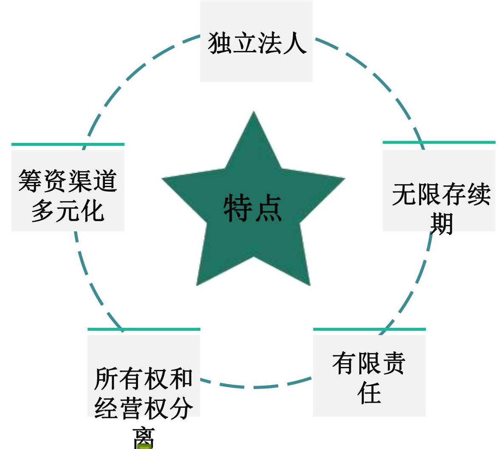

特点: 所有权与经营权分离一一其他两种组织形式的根本区别

__________

公司的组织结构个人所有制企业 无限责任

利润缴纳个人所得税合伙制企业

有限责任公司 利润缴纳公司税+红利缴纳个人所得税

__________

## 公司制和合伙制的比较

<table><tr><td>內容</td><td>公司制</td><td>合伙制</td></tr><tr><td>流动性和 可交易性</td><td>股份可以交易而公司无需 终结</td><td>合伙制企业的交易市场一般不 存在。</td></tr><tr><td>投票权</td><td>在表决重大事项和选举董 事会时,普通股股东每拥 有一股就享有一票</td><td>有限合伙人享有一些投票权, 一般合伙人完全控制和管理企 业的运作。</td></tr><tr><td>税收</td><td>双重征税:公司收入要征 企业所得税,分给股东的 现金股利也要征税</td><td>不交企业所得税,合伙人从企 业获得利润需缴纳个人所得税</td></tr><tr><td>再投资 和分红</td><td>公司在股利支付政策上有 很大选择余地</td><td>一般不允许把合伙制企业的利 润进行在再资,所有利润都分 给合伙人。</td></tr><tr><td>责任</td><td>股东个人不对公司债务承 担责任</td><td>有限合伙人对企业债务不承担 责任,一般合伙人可能要承担 无限责任。</td></tr><tr><td>存续</td><td>公司可以无限存续</td><td>合伙制企业只有有限存续期</td></tr></table>

## 企业财务活动

## －企业筹资引起的财务活动 －企业投资引起的财务活动 －企业经营引起的财务活动 －企业分配引起的财务活动

__________

__________

---

公司财务活动是以现金收支为主的资金收支活动的总称。这些财务活动构成了财务管理的内容。

---

## (一) 筹资活动

# 资产=负债+所有者权益  资金= 负债资金或借入资金+ 权益资金或自有资金

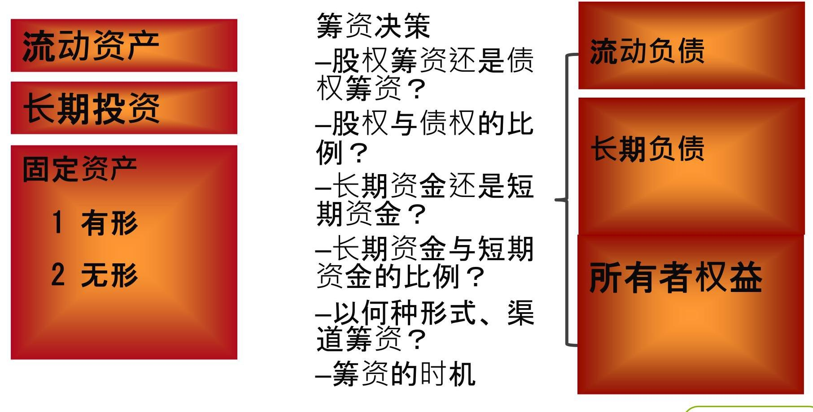

__________

__________

__________

(二)投资活动 __________

包括:对内投资+对外投资；

固定资产、无形资产 股票+债券+其他(联营)

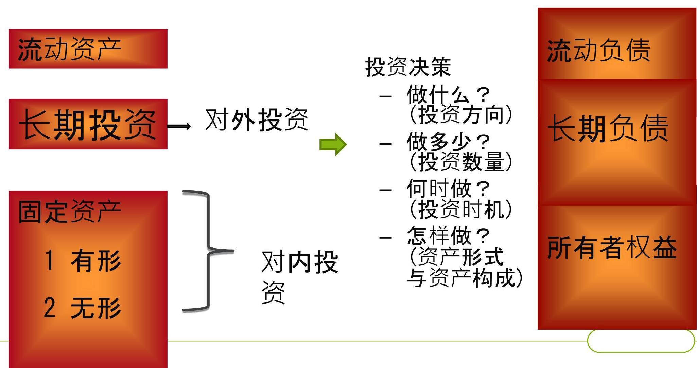

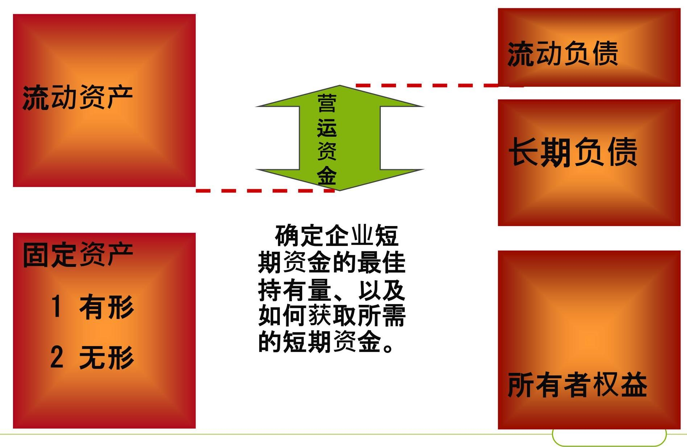

__________

__________

## (三)资金营运活动

__________

## (四)分配活动

__________

①收入-成本费用-流转税=营业利润

营业利润(内部)+投资净收益(外部)+营业外收支净额= 利润总额； ②利润总额-所得税=税后净利； ③ 税后净利-公积金-公益金=可供分配的利润； ④可供分配的利润-向投资者分配的利润=未分配利润； ·广义分配,指收入和利润的分配,即①②③④； ·狭义分配,仅指利润的分配,即②③④ ·利润分配活动中:

- 信奉什么样的利润分配政策？

- 以什么形式分配利润?

## 财务关系

(一)概念:企业在组织财务活动过程中与有关各方发生的经济利益关系

(二)财务关系的内容与实质

内容

企业与政府 (税务机关)

企业与投资者

企业与受资者

企业与债权人

企业与债务人

企业内部各单位之间

企业与职工之间

实质

强制性与无偿性的分配关系经营权与所有权的关系投资与受资的关系债务与债权的关系债权与债务的关系内部各单位之间的利益关系劳动成果的分配关系

__________

__________

## 第二节 财务管理的目标

财务管理的目标是企业理财活动希望实现的结果, 是评价企业理财活动是否合理的基本标准。 根本目标 通过生产经营活动创造更多的财富,不断增加企业价值财务管理内外部环境不同

利润最大化 股东财富最大化

## 利润最大化的观点认为,企业财务管理的目标是利润最大化,这 是因为利润代表了企业新创造的财富,利润越多则企业的财富增 加得越多,越接近企业的目标。

<table><tr><td>财务报表</td><td>会计等式</td></tr><tr><td>利润表 资产负债表</td><td>收入-费用+直接计入当期损益的利得和损失=净利润. 净利润-股利分配=留用利润(盈余公积+未分配利润) 资产=负债+股东权益 =负债+股本+资本公积+留用利润(盈余公积+未分配利润)</td></tr></table>

## 财务报表之间的钩稽关系

## 具有一定合理性

公司追求利润最大化,就必须讲求经济核算,加强管理,改进技术,提高劳动生产率,降低产品成本。这些措施都有利于资源的合理配置,有利于经济效益的提高。

目前,我国企业的业绩评价在很多情况下还是以利润为基础。

__________

__________

## 以利润最大化为目标

__________

__________

## ·问题:

- 忽略时间价值。

A方案:投资5年后获利200万；B方案:每年收回40万,5年。 ·未考虑获取收益和所承担风险间的关系。

同样投入500万,每年获利100万,一个获利全部转化成现金, 一个是应收账款。

·没有考虑利润和投入资本的关系。

·假设两个项目都在今年获得了100万元利润并且取得的都是现金收

入。项目一只需投资100万元；项目二需要投资300万元

·面向历史而不是面向未来

·短期行为:会促使经营者少提不提折旧,少摊不摊费用损失。

- 现金收益不等于会计利润

- 创造性会计

## 现金收益不等于会计利润

营业性支出与资本支出

·营业性支出(只在当期产生收益的费用):当期扣除 ·资本性支出(多期产生收益的费用):各期摊提 ·非现金费用(折旧费,待摊费):计入成本,但不产生现金流出

- 权责发生制与现金收付制一应收与应付 ·当期延迟付款、坏帐、提前付款、上期欠款

__________

## 创造性会计 (财务点金术)

__________

国内稳定的增长是公司追求的目标,所以利用 “熨斗”来“熨平”利润是管理者的天职

- 财务点金术:迅速实现帐面利润,但不增加价值

- 例 : 100万元在一天内实现40万利润

·购入

- 10块真金砖*9=90

- 10块镀金砖*1=10

·报告:用100万元得到20块金砖,平均成本5 万元

·卖出真金:实现利润(9-5)*10=40

__________

## 2. 财务管理的目标

财务管理的目标是 以利润最大化为目标

公司理财活动所希望 以股东财富最大化为目标 实现的结果,是评价公司理财活动是否合理的基本标准。

__________

## 以股东财富最大化为目标(股票价格最大化)

## 有效市场假设: 最早是由Fama提出,根据历 史信息、全部公开信息和内 幕信息对股票价格的不同影 响将市场效率分为弱型有效

市场、半强型有效市场和强型有效市场。在强型有效的资本市场上,股东财富最大化目标可以用股票价格最大化来替代。

观点:股东财富最大化有效市场

股票价格最大化

证券的价格反映了所有公开和未公开信息,投资人即使掌握内幕信息也无法获取超额利润

强式有效市

证券的价格包含了所有公开信息, 投资人不能通过分析公开信息来获取超额利润

半强式有效市场弱式有效市场

## 以股东财富最大化为目标

## > 主要优点

考虑了时间价值和风险因素克服了追求利润的短期行为反映了资本与报酬之间的关系。因为股票价格是对每股股份的标价,反映的是单位投入资本的市场价格

- 股东财富最大化目标也是判断企业财务决策是否正确的标准

__________

__________

股东财富最大化目标也是判断企业财务决策是否正确的标准。原因: 股票的市场价格是企业投资决策、筹资决策和资产管理决策效率的反映。

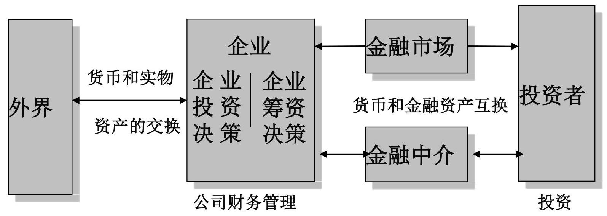

企业的投资工具模型

企业的投资决策等的好坏会通过股票价格表现,因此,企业决策时必须要综合考虑多种因素,符合股东的最大利益。

问题:

1. 股东价值最大化是否会损害债权人的利益？

2. 股东价值最大化是否会牺牲其他利益集团的正常利益？

3. 股东价值最大化是否可以忽视公司的社会责任？

__________

__________

## 股东价值最大化是否会损害债权人的利益

- 企业的价值=负债+所有者权益的价值

- 负债的基本特征是公司承诺在某一确定时间支付给债权人一笔固定的金额。

- 股东对公司价值的索取权=支付给债权人之后的剩余部分,

- 如果公司的价值等于或少于承诺支付给债权人的金额,股东什么也得不到。

# 债务资本和权益资本的或有索取权

Payoff to Payoff to debt holders shareholders Value of the firm (X) Debt holders are promised \$F. If the value of the

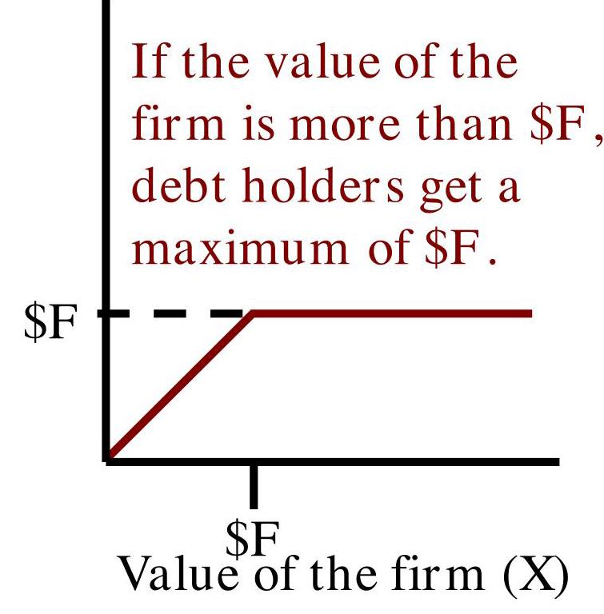

If the value of the firm is less than \( \$ \mathrm{\;F} \) , firm is more than \$F, share holders get they get whatever the firm is worth. everything above \( \mathrm{{SF}} \) .

Algebraically, the bondholder's Algebraically, the shareholder's claim is: Min[\$F,\$X] claim is: Max[0,\$X-\$F]

股东价值最大化是否会牺牲其他利益集团的正常利益

牺牲其他利益集团的正常利益是无法实现股东财富最大化的。

·如果企业产品质量不高,企业的产品将失去市场；

·如果企业压低工人工资,企业将得不到优秀的工人；

- 如果企业违反法律法规,企业将失去存在的基本资格。

## 股东价值最大化是否可以忽视公司的社会 责任

- 股东财富最大化并不排除管理者就可以忽视公司的社会责任；

- 保护消费者权益、向雇员支付薪金、保持公正的雇佣和安全的工作环境、支持职工教育以及参与净化空气和水资源的环境保护活动等；

- 在这种情况下 股东财富最大化 仍然是一个可行的目标.

因为股东财富是依赖于其所承担的社会责任。由于社会责任的标准很难定义。因此,大多数社会责任都必须通过立法以强制的方式让每个公司平均负担(例如《消费者权益保护法》,即公司必须在各种法律约束下追求公司价值最大化。

## ・缺点:

__________

__________

__________

## 注意:

- 股东财富最大化的目标并不意味着企业经营过程中不存在着矛盾和制约。为什么？

1. 企业经营过程中利益相关者的矛盾

2. 股东财富最大化目标的实现需要注意的问题。

__________

以股东财富最大化为目标

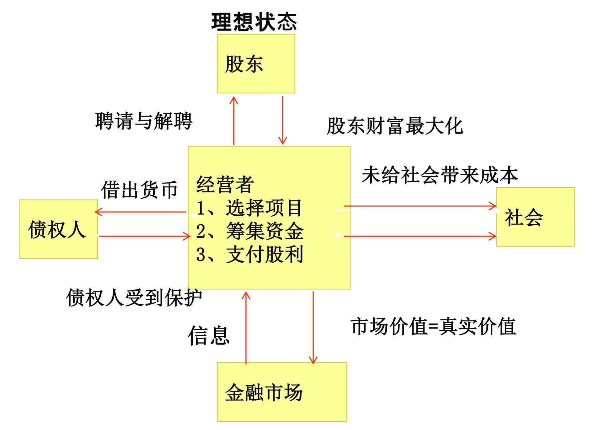

__________

__________

## 财务管理目标与利益冲突

1. 委托-代理问题与利益冲突

>冲突之一:股东与管理层

>冲突之二:大股东与中小股东

>冲突之三:股东与债权人

2. 社会责任与利益冲突

__________

__________

## 委托-代理问题与利益冲突

## 冲突之一:股东与管理者

当所有权与经营权相分离(产生的基本原因),居于企业外部的股东和居于企业内部的管理者将会发生利益上的冲突。

道德危机逆向选择

---

事件回放

---

安然总裁肯尼思. 莱等抛售股票获利11亿,全身而退；施乐虚增万；美国证券交易委员会对公司造假行为罚款1000万:公司高层向公众说谎,却由投资人承担责任？

__________

__________

## 冲突之一:股东与管理者

- 基本原因:资本所有权与经营权相分离

- 产生条件:信息不对称,代理人与委托人的目标函数不一致

- 行为方式:代理人在代理过程中会产生职务怠慢、损害或侵蚀委托人

- 解决方式:通过契约关系对代理人实行激励、约束和惩训。

- 激励:绩效股、股票期权

- 股东直接干预

- 机构投资者

---

有人认为,对管理者的最大监督并非来自所有者,而是来自经理人才市场

---

- 法律规定

- 被解聘的威胁

- 被收购的威胁

## 冲突之一:股东与管理者

所有者和股东目标:希望以较小的享受成本支出带来更高的企业价值或股东财富。

有人把企业经营者的效用函数表示成:U=U(W, P, A, J)+U(B, C) 其中:W表示经营者的职位, P表示经营者的社会地位A表示经营者自我实现的程度 , J表示经营者的显性收入, B表示经营者的隐性收入, C表示经营者以渎职方式取得的收入。

## 股东与管理者

马仆

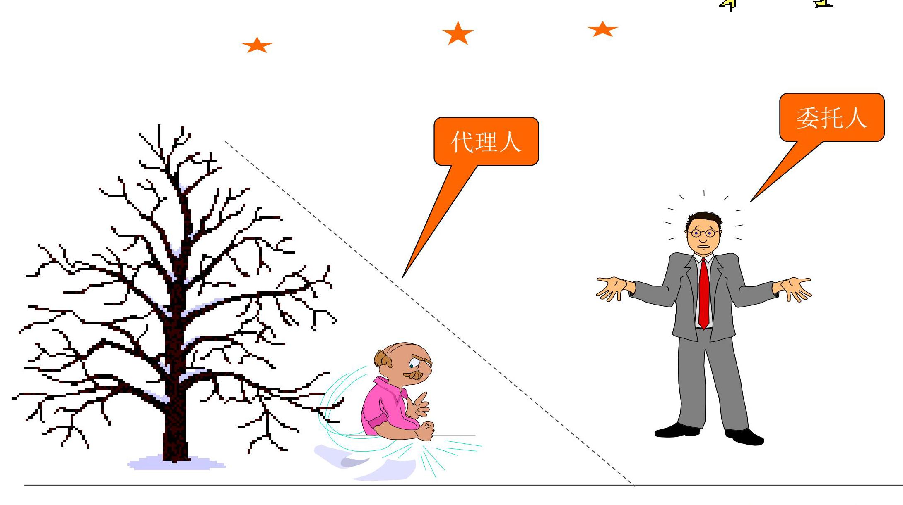

44

## 讨论:委托-代理均衡合同

## 财务管理目标与利益冲突

>委托-代理问题与利益冲突

>冲突之一:股东与管理层

>冲突之二:大股东与中小股东

>冲突之三:股东与债权人

社会责任与利益冲突

__________

__________

## 冲突之二:大股东与中小股东

大股东通常持有企业大多数的股份,能够左右股东大会和董事会的决议,委派企业的最高管理者,掌握着企业重大经营决策的控制权。

大股东侵害中小股东利益的形式:

- 关联交易转移利润

- 非法占用巨额资金、利用上市公司进行担保和恶意融资

6 发布虚假信息,操纵股价,欺骗中小投资者

- 为派出的高级管理者支付过高的薪酬

- 不合理的股利政策,掠夺中小股东的既得利益。

保护机制:

1、完善公司治理结构

2、规范信息披露制度

## 财务管理目标与利益冲突

>委托-代理问题与利益冲突

>冲突之一:股东与管理层

>冲突之二:大股东与中小股东

>冲突之三:股东与债权人

社会责任与利益冲突

__________

__________

## 3. 股东与债权人

__________

__________

• 基本原因:现金流量要求权不同:

(1)债权人一投资回报是固定的；

(2)股东一其收益随企业的经营效益而变化。

·产生条件:股东与债权人的目标函数不同、信息不对称

- 行为方式:高风险投资、发行新债

·高风险投资

(1)投资成功,股东拿大头,债主拿小头；

(2)企业破产,若债务资本 > 权益资本,则:债权人损失 > 股东的损失

## 债权人为保护自己的利益通常采取的措施

- 1、签订资金使用合约,设定限制性条款 - 2、拒绝业务往来,要求高利率。

__________

__________

## 财务管理目标与利益冲突

>委托-代理问题与利益冲突

>冲突之一:股东与管理层

>冲突之二:大股东与中小股东

>冲突之三:股东与债权人

社会责任与利益冲突

__________

__________

## 财务管理目标与利益冲突

- 社会责任与利益冲突

很多情况下, 公司的目标与社会目标是一致的, 但也有许多例外。

在要求企业自觉承担大部分社会责任的同时, 也要通过法律等强制命令规范企业的社会责任, 并让所有企业均衡地分担社会责任的成本,以维护那些自觉承担社会责任的企业的利益。

__________

__________

以股东财富最大化为目标

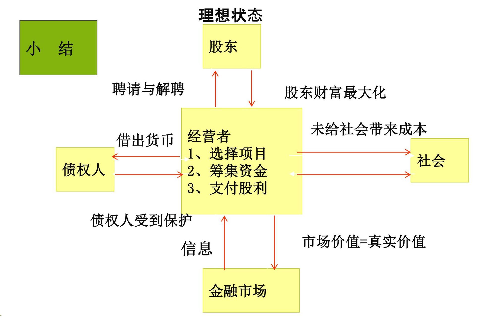

__________

__________

以股东财富最大化为目标

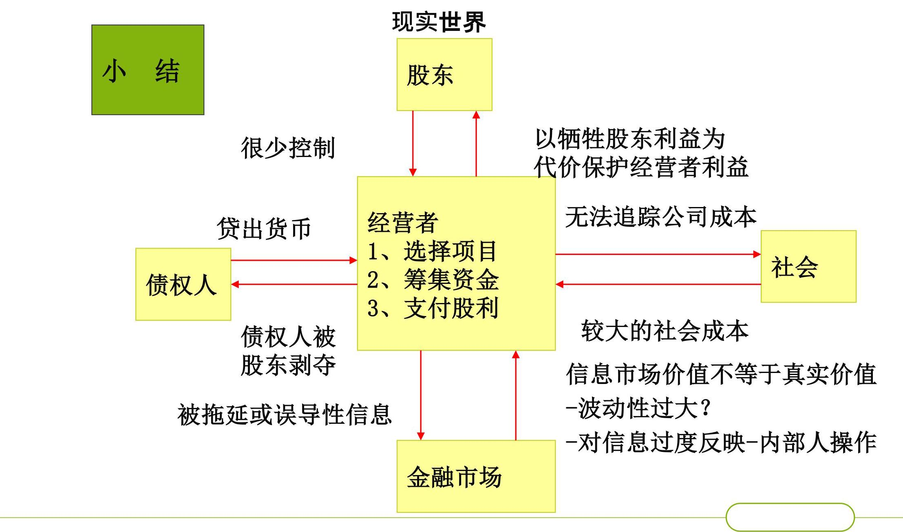

__________

__________

以股东财富最大化为目标

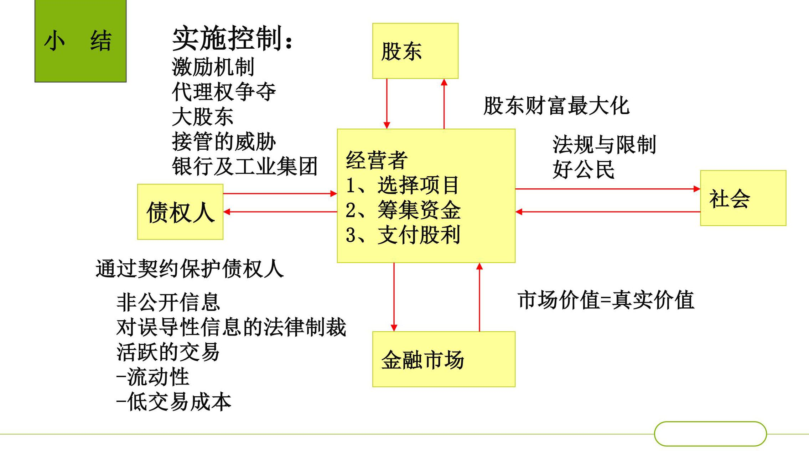

__________

__________

## 第三节 财务管理环境

财务管理环境也称理财环境,是影响企业财务活动、财务关系和财务管理的各种因素的总和。

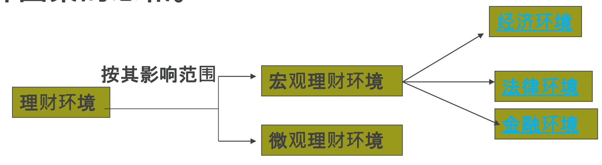

## 1. 经济环境

财务管理的经济环境是影响企业财务管理的各种经济因素, 如经济周期、经济发展水平、通货膨胀状况、政府的经济政策等。

① 经济周期复苏繁荣衰退萧条

<table><tr><td>复苏</td><td>繁荣</td><td>衰退</td><td>萧条</td></tr><tr><td>1. 增加厂房设备 2. 实行长期租赁 3. 建立存货 4. 引入新产品 5. 增加劳动力</td><td>1. 扩充厂房, 设备 2. 继续建立存货 3. 提高价格 4. 开展营销规划 5. 增加劳动力</td><td>1. 停止扩张 2. 出售多余设备 3. 停产不利产品 4. 停止长期采购 5. 削减存货 6. 停止扩招雇员</td><td>1. 建立投资标准 2. 保持市场份额 3. 缩减管理费用 4. 放弃次要利益 5. 削减存货 6. 裁减雇员</td></tr></table>

__________

II II \( {}^{3} \) 4-14 AUE OPA A PAEB A O

② 经济发展水平发达国家发展中国家不发达国家

③ 通货膨胀

引起资金占用的大量增加引起公司利润虚增引起利率上升引起有价证券价格下降引起资金供应紧张

④ 经济政策

__________

__________

## 2. 法律环境

指影响企业财务活动的各种法律、法规和规章

·企业价值取决于该企业税后现金流。

·有效的税务计划是公司财务的一项重要责任。

如:《公司法》、《经济 + 企业组织法 合同法》、《破产法》

+ 税收法规 如:所得税、流转税、其 他稅种

+ 财务法规 如:《企业财务通则》、 《企业财务制度》

没有规矩无以成方圆

① 个人所得 股利、利息——比例税率 (20%) 资本利得——交易印花税 \( \left( {5 \sim  6\% 0,{3.5}\% 0,1\% 0}\right) \) 特别提示* 政府债券、国家银行金融债券其利息收入免 征个人所得税

__________

__________

## ② 资本利得与利失——直接买卖金融资产的损益

③ 公司所得税 = 应纳税所得额 \( \times \) 所得税率(25%)

应纳税所得额 \( = \) 会计利润+( - )调整项目

④ 红利与利息收入——持有资本资产的收益

⑤ 红利与利息的支付——发行股票和债券的筹资成本

- 向非个人股东——直接支付

- 向个人股东——代扣代缴20% 所得税后支付

__________

__________

## 3.金融市场:进行资金融通的场所 类型

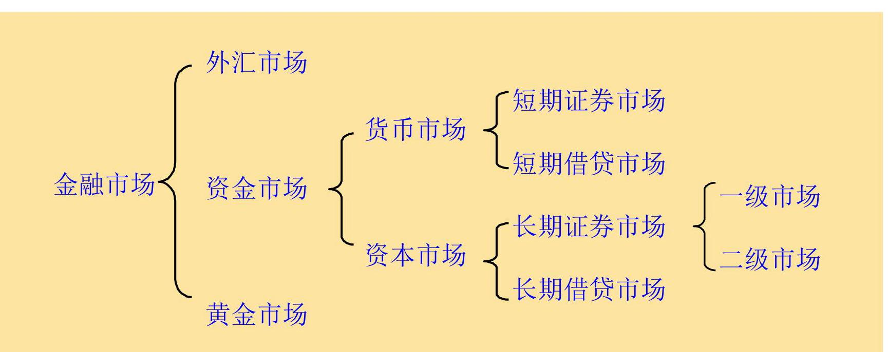

ii ii ½选近日¡μ Å,让孩童

## ① 金融市场与企业理财

- 为公司筹资和投资提供场所

- 实现长短期资金的互相转化

- 为公司理财提供相关信息

__________

__________

② 金融市场构成

- 主体:银行和非银行金融机构,链接投资人和筹资人的桥梁

- 客体:金融工具,如股票、债券、商业票据等

- 参加人:客体的供应者和需求者,如企业、政府部门和个人

__________

__________

__________

## ③ 金融工具

- 货币市场证券:短期债务,如商业本票、银行承兑汇票、国库券、银行同业拆借等

- 资本市场证券:股票、长期公司债券等

- 特点:

1、流动性

2、收益性

3、风险性

三种属性相互联系、互相制约。流动性和收益性成反比,收益性和风险性成正比。

__________

## 4. 利息率及其测算

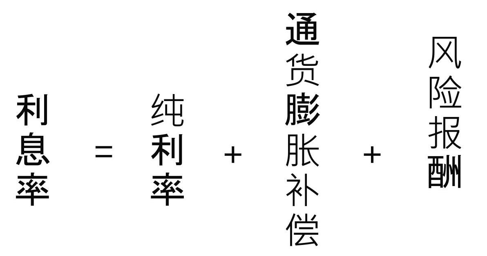

__________

- 纯粹利率是指无通货膨胀、无风险的情况下平均利率。在没有通货膨胀时,国库券的利率可以视为纯粹利率。纯粹利率的高低受平均利润率、资金供求关系和国家调节的影响。

- 通货膨胀补偿。以弥补通货膨胀造成的购买力损失。每次发行的国库券利率随预期的通货膨胀率的变化,它(国库券的利率)等于纯粹利率加上预期通货膨胀率。

短期无风险证券利率=纯利率+通货膨胀补偿

## 风险补偿。是指投资者要求资金能否保证收回本金而采取的收益。风 险越大要求的收益率就越高,风险和收益之间存在对等的关系。是投 资者要求的风险补偿。

违约风险报酬

- 流动性风险报酬

- 期限风险报酬

违约风险是指借款人无法按时支付利息或偿还本金而给投资人带来的风险。 违约风险的大小与借款人信用等级的高低成反比。

## 为了弥补违约风险,投资人所要求提高的贷款利率即为违 约风险溢酬。

<table><tr><td rowspan="2"/><td rowspan="2">国库券 (1)</td><td rowspan="2">Aaa级 公司债券 (2)</td><td rowspan="2">Baa级 公司债券 (3)</td><td colspan="2">违约风险报酬率</td></tr><tr><td>Aaa (4) \( = \left( 2\right)  - \left( 1\right) \)</td><td>Baa (5) \( = \left( 3\right)  - \left( 1\right) \)</td></tr><tr><td>2007年8月</td><td>4.11%</td><td>5.79%</td><td>6.54%</td><td>1. 68%</td><td>2.43%</td></tr></table>

注意:由政府发行的国库券可视为无违约风险的证券,公司债券的违约风险一般根据其信用等级来确定。实务中也可按下式确定违约风险:

违约风险=公司债券利率—政府债券利率

__________

## 违约风险补偿(溢酬)

__________

## 流动性风险报酬

流动性是指某项资产迅速转化为现金的可能性。

资产变现能力越强,流动性越好,流动性风险越小。

一般而言,在违约风险与到期风险相同的条件下,最具流动性的金融资产与最不具变现力的金融资产彼此间的利率差距介于1%一2%之间,即为流动性风险报酬。

__________

__________

期限风险报酬

## 一项负债到期日越长,不确定因素就越 多,为弥补这种风险给予的补偿(期限风

一般而言,因受到期风险的影响,长期利率会高于短期利率,但有时也会出现相反的情况。

因为短期

投资存在再

投资风险！

__________

__________

## 4. 社会文化环境

- 社会文化环境包括教育、科学、文学、艺术、新闻出版、广播电视、卫生体育、世界观、理想、信念、道德、习俗,以及同社会制度相适应的权利义务观念、道德观念、组织纪律观念、价值观念、劳动态度等。

小案例 - 中国一拖科特迪瓦农机装配公司在科特迪瓦有过劳资纠纷经历。这家公司在1998年开业当年,就毫无思想准备地陷入了一场旷日持久的劳资纠纷。引发这场纠纷的 “导火索” 是公司对部分当地员工不满意,准备辞退他们。这些员工不服,把公司告上法庭,索赔 9000万西非法郎(折合30多万美元)。由于公司不熟悉当地法律,这场官司一直拖到2005年才了结,公司最终赔偿800万西非法郎。

__________

__________