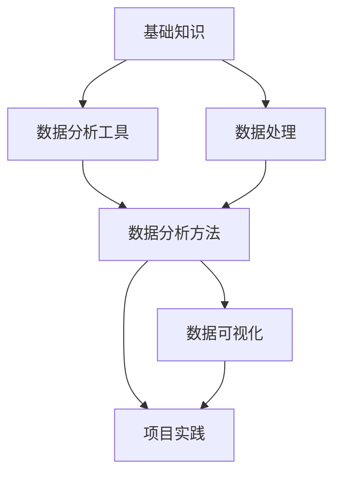

# 00-数据分析学习路径

## 数据分析学习体系 

数据分析是将原始数据转化为有用信息的过程，帮助我们理解现象、发现规律、做出决策。建立系统化的学习路径，将有助于循序渐进地掌握数据分析技能。

## 学习路径概述

## 1. 数据分析基础 

- **01-统计学基础**：描述统计、概率论、假设检验、置信区间
- **02-数学基础**：线性代数、微积分基础、优化方法
- **03-数据分析思维**：分析框架、逻辑思维、批判性思考
- **04-商业分析基础**：业务指标、数据驱动决策

## 2. 数据分析工具

- **01-Excel数据分析**：函数、数据透视表、图表、分析工具
- **02-Python数据分析**：NumPy、Pandas、Matplotlib、Seaborn
- **03-R语言数据分析**：基础语法、统计分析、可视化
- **04-SQL数据查询**：基础语法、复杂查询、数据库设计
- **05-数据分析平台**：Tableau、Power BI、DataV等

## 3. 数据处理技术

- **01-数据获取**：API、爬虫、数据库连接、开放数据集
- **02-数据清洗**：缺失值处理、异常值处理、重复数据
- **03-数据转换**：特征工程、归一化、标准化、降维
- **04-大数据处理**：分布式计算、Hadoop、Spark

## 4. 数据分析方法

- **01-描述性分析**：集中趋势、离散程度、分布特征
- **02-探索性分析**：相关分析、聚类分析、主成分分析
- **03-预测性分析**：回归分析、时间序列分析、机器学习模型
- **04-归因分析**：因果推断、A/B测试、实验设计
- **05-文本分析**：自然语言处理、情感分析、主题提取

## 5. 数据可视化

- **01-可视化原理**：数据可视化理论、视觉感知、图表选择
- **02-静态可视化**：图表类型、视觉设计、配色原则
- **03-交互式可视化**：仪表盘设计、用户体验、交互原则
- **04-地理空间可视化**：地图可视化、空间数据分析

## 6. 项目实践

- **01-数据分析项目流程**：问题定义、数据收集、分析、呈现、决策
- **02-行业应用**：金融分析、市场分析、用户分析、运营分析
- **03-案例研究**：经典分析案例、方法论应用案例
- **04-个人项目**：实际数据分析项目实践

## 学习资源

- 参考教材
- 在线课程
- 优质网站和博客
- 数据分析社区

## 学习计划

短期（1-3个月）：
- 掌握统计学基础知识
- 熟练使用Excel进行基础数据分析
- 学习Python基础和Pandas库

中期（3-6个月）：
- 掌握Python数据分析生态系统
- 学习数据可视化技术
- 完成2-3个小型数据分析项目

长期（6个月以上）：
- 深入学习高级分析方法
- 掌握机器学习在数据分析中的应用
- 建立个人数据分析项目组合

## 关联学科

- [[04-统计学]] - 数据分析的理论基础
- [[06-财务管理学]] - 财务数据分析的应用场景
- [[01-经济法]] - 数据分析在经济领域的应用 